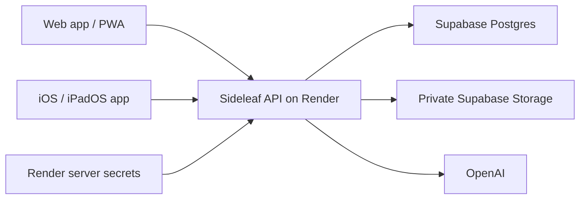

# Hosting and secrets for Sideleaf

Recommendation recorded 2026-09-07. This describes the deployment target. No cloud resources have been provisioned or connected yet.

## One shared backend

Use one paid Render web service to run the existing Node/Hono API and serve the built React web app. Both clients use the same HTTPS API and account identity. Supabase supplies Postgres and private file storage. OpenAI is called by the backend for the planned cloud AI features.

The native app runs on the device and is distributed separately. It needs the shared API URL and the user's authenticated session. It does not need a second backend or copies of provider keys. The intended result is the same notes, account and usage allowance on both clients, with local drafts synchronized through the shared revision protocol. Native sign-in and synchronization still need implementation.

## What each service hosts

| Service | Responsibility |
| --- | --- |
| GitHub | Source code and deployment history |
| Render | Built web app, API, authentication, future streaming relay and AI calls |
| Supabase Postgres | Users, sessions, notebooks, page revisions and future finalized transcripts |
| Supabase private Storage | Future drawing artifacts, previews and permitted attachments |
| OpenAI | Future cloud transcription and text processing |

The current Hono production entry point already serves `dist/web`, so one deployment can serve `/` and `/api/*` from the same origin. Begin with Render's HTTPS address; attach a chosen app subdomain later. The domain has not been selected or purchased. Render supports the existing Dockerfile, custom domains and WebSockets. Paid compute is recommended for meetings because its free web services can sleep between uses. [Render web services](https://render.com/docs/web-services), [Docker](https://render.com/docs/docker), [domains](https://render.com/docs/custom-domains), [WebSockets](https://render.com/docs/websocket), [free service limitations](https://render.com/docs/free).

Keep durable data in Supabase. Deployments must not depend on the Render container filesystem retaining notes or files. Sideleaf's planned audio pipeline uses bounded memory buffers and saves no audio recordings; disclosure of OpenAI processing and retention is covered separately in [privacy.md](privacy.md).

## Where credentials live

Production secrets belong in the Render service's environment settings, entered directly there. An environment group can share selected secrets if a background worker is added later. A separate secret-management service is not needed for this initial deployment. Render may also make configured variables available as Docker build arguments, so keep secret values out of Docker `ARG` declarations and frontend build inputs. [Render environment variables and secrets](https://render.com/docs/configure-environment-variables), [Docker build behavior](https://render.com/docs/docker).

| Variable | Secret? | Purpose and current status |
| --- | --- | --- |
| `DATABASE_URL` | Yes | Supabase Postgres connection; supported by current backend, cloud path untested |
| `BETTER_AUTH_SECRET` | Yes | Stable server authentication secret; supported now |
| `OPENAI_API_KEY` | Yes | Dedicated Sideleaf project key; provider integration is still to be built |
| `SUPABASE_SECRET_KEY` | Yes | Proposed server credential for private Storage; integration is still to be built |
| `GOOGLE_CLIENT_SECRET` | Yes | Supported optional Google login configuration |
| `GOOGLE_CLIENT_ID` | No | Google login identifier, paired with the server secret |
| `SUPABASE_URL` | No | Proposed Storage project address; keep in server configuration initially |
| `APP_ORIGIN` | No | Public HTTPS address for the app and authentication |
| `NODE_ENV` | No | Set to `production` on the deployed server |
| `PORT` | No | Hosting platform's assigned listening port |

OpenAI requires provider keys to remain on the server. Neither a JavaScript bundle nor an installed native app is a secret store for a shared provider key. The native Keychain will hold that user's session credentials, not Sideleaf's OpenAI or database credentials. Rotating an OpenAI key then requires updating the backend environment and restarting or redeploying that service, without distributing new client binaries. [OpenAI authentication](https://developers.openai.com/api/reference/overview#authentication).

Supabase secret keys bypass RLS and stay on the backend. A publishable key has a different purpose and is not a replacement for the Postgres connection password. This initial design needs no Supabase key in either client. Keep Better Auth initially and disable the Supabase Data API for the server-only database path; Hono remains responsible for checking ownership. [Supabase keys](https://supabase.com/docs/guides/getting-started/api-keys), [secure database access](https://supabase.com/docs/guides/database/secure-data).

## Preparing accounts

Create a dedicated Sideleaf Supabase development project and a dedicated OpenAI project/key for development. Keep production data and credentials separate when production is introduced. Save new credentials in a password manager while the connection is being prepared; they do not need to be sent in chat or committed to GitHub.

For Supabase, retain the project URL and connection details from the Connect dialog. For Render, the session pooler on port 5432 is the expected connection method because Supabase currently identifies Render as IPv4-only. We must verify TLS and the actual connection before applying migrations. Use nearby hosting and database regions. [Connection methods](https://supabase.com/docs/guides/database/connecting-to-postgres), [network compatibility](https://supabase.com/docs/guides/troubleshooting/supabase--your-network-ipv4-and-ipv6-compatibility-cHe3BP).

The code checkout is in OneDrive. Local development secrets should eventually be loaded from a file outside that synced folder, or injected into the API process environment. The current scripts load only the repository `.env`; an external-file loader has not been added. Do not put real keys into `.env.example`. Git and Docker ignore rules now also cover `.env.local`, `.env.production` and other `.env.*` variants, while the blank example remains trackable in Git.

## Remaining deployment work

- Verify the Docker build and Supabase connection with the chosen accounts. Render's health-check path should be `/api/health`; the Docker health check now respects `PORT` as well. The API health route currently establishes process readiness, not an ongoing database connectivity check.
- Separate schema migrations from application startup before using a restricted runtime database role. The current startup executes schema DDL, so a least-privilege runtime configuration is not yet implemented.
- Configure production sign-in. Current source disables production email/password login; Google credentials are required unless another production login path is implemented.
- Connect private Storage through ownership-checked routes, then verify access and deletion across accounts.
- Implement and test native authentication, session storage and synchronization against this API.
- Implement OpenAI capture and text adapters, usage enforcement, cancellation, disconnect recovery and the reviewed disclosure. Adding a key alone does not enable transcription.

Supabase's recent default-grant change does not replace these checks. Existing table grants can remain, and direct ORM connections are unaffected by that Data API change. [Relevant changelog](https://supabase.com/changelog/45329-breaking-change-tables-not-exposed-to-data-and-graphql-api-automatically).
