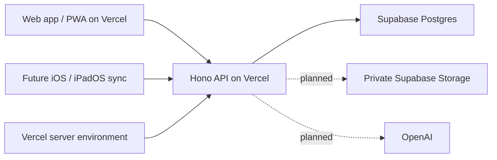

# Hosting and secrets for Sideleaf

Updated 2026-09-07. The hosted notebook beta is live at [sideleaf.vercel.app](https://sideleaf.vercel.app), using the owner's selected Vercel and Supabase projects. The Vercel Sideleaf team/project is linked to [ThinkHale/Sideleaf](https://github.com/ThinkHale/Sideleaf). Supabase project `qhgzilyanroqomafhybg` has the private eight-table notebook schema migrated. Restricted database TLS, live production API checks and desktop/phone browser workflows have passed.

## One shared backend

Vercel hosts both the built React web app and the Node/Hono API. There is no separate Render service in the selected architecture. Supabase hosts PostgreSQL; Better Auth owns Sideleaf accounts and sessions. The web app uses same-origin `/api/*` routes. The future native app will use the same HTTPS API and identity system.

The native app runs on the device and is distributed separately through Apple's tooling. It needs the public API URL and the signed-in user's session. It does not need a separate backend or copies of shared provider credentials. Native sign-in and synchronization remain unfinished, so notes do not yet flow between the web app and the native source.

## Current deployment

| Component                | Responsibility and status                                                         |
| ------------------------ | --------------------------------------------------------------------------------- |
| GitHub                   | Source repository and Vercel project linkage                                      |
| Vercel static output     | Vite build in `dist/web`, served from the Sideleaf project                        |
| Vercel Node function     | `api/index.ts` initializes Hono for `/api/*`                                      |
| Supabase Postgres        | Private `sideleaf` schema with auth data, notebooks, pages and revisions          |
| Better Auth              | Password hashing, sessions, optional Google login and database-backed rate limits |
| Supabase private Storage | Planned editable ink artifacts and permitted attachments; not integrated          |
| OpenAI                   | Planned transcription and text processing; no key or adapter connected            |

The root [vercel.json](../vercel.json) is active. It builds the frontend and routes API requests to the local Node function. API responses have private cache controls; the service worker caches static assets, not auth or notebook API responses. The former [external-proxy template](../deploy/vercel.example.json) is historical and inactive. [Vite hosting](https://vercel.com/docs/frameworks/frontend/vite), [Node function entry points](https://vercel.com/docs/functions/runtimes/node-js).

The API reuses one initialization promise per warm instance, opens a bounded `pg.Pool`, checks auth-table access, and attaches Vercel's pool lifecycle support. Failed initialization can retry later. The selected database route is Supabase's transaction pooler on port 6543, with unnamed SQL queries rather than named prepared statements. Verified TLS passed through the actual restricted connection using the official root certificate bundled at `server/certs/supabase-root-2021.crt`. The certificate is public trust material, not a secret. [Vercel pooling](https://vercel.com/kb/guide/connection-pooling-with-functions), [Supabase connection modes](https://supabase.com/docs/guides/database/connecting-to-postgres).

The public origin is `https://sideleaf.vercel.app`. `APP_ORIGIN` can pin that address; the server can also derive the production or preview origin from Vercel's environment. Cookies, callbacks and mutation-origin checks must match it. Preview and production currently share the beta database, so either deployment can affect the same accounts and notes. Isolate preview data and credentials before wider production use. The current function duration is 30 seconds, appropriate for this notebook API. Live audio transport has not been validated against this deployment's execution limits.

## Where credentials live

The database and authentication secrets are configured in the Sideleaf Vercel project's server environment settings. They are injected into the API process, not copied into the browser bundle or native app. A separate secret-management service is unnecessary for this initial single backend. Preview isolation is still outstanding as noted above. Environment changes need a new deployment to reach the running code. [Vercel environment variables](https://vercel.com/docs/environment-variables).

| Variable                                    | Secret?                          | Location and purpose                                                                                     |
| ------------------------------------------- | -------------------------------- | -------------------------------------------------------------------------------------------------------- |
| `DATABASE_URL`                              | Yes                              | Vercel server environment; restricted `sideleaf_runtime` transaction-pooler connection with verified TLS |
| `BETTER_AUTH_SECRET`                        | Yes                              | Vercel server environment; stable random authentication secret of at least 32 characters                 |
| `MIGRATION_DATABASE_URL`                    | Yes                              | Administrative migration session only; not required by the deployed function                             |
| `ENABLE_PASSWORD_AUTH`                      | No                               | Vercel server environment; `true` explicitly enables the selected email/password beta                    |
| `APP_ORIGIN`                                | No                               | Exact public HTTPS origin; optional when derived from the correct Vercel environment                     |
| `NODE_ENV`                                  | No                               | `production` in the deployed function                                                                    |
| `GOOGLE_CLIENT_ID` / `GOOGLE_CLIENT_SECRET` | Client ID public; secret private | Optional server-side Google login configuration; not verified                                            |
| `OPENAI_API_KEY`                            | Yes                              | Future Vercel server variable; not connected and not sufficient to enable capture                        |
| `SUPABASE_SECRET_KEY`                       | Yes                              | Future server credential if private Storage needs it; never exposed to clients                           |
| `SUPABASE_URL`                              | No                               | Future Storage configuration; no Supabase client connection is required by the present UI                |

Neither `VITE_*` variables nor native configuration files are safe locations for shared secrets. The native Keychain will store the user's own session credentials. Rotating a provider key should only require replacing the backend secret and redeploying, without rebuilding either client. [OpenAI authentication](https://developers.openai.com/api/reference/overview#authentication).

Supabase API keys and PostgreSQL passwords serve different interfaces. The current backend uses a database connection and Better Auth, not Supabase Auth. No Supabase publishable or privileged API key belongs in either client for this architecture. Privileged Storage keys can bypass RLS and must stay on the server if later introduced. [Supabase API keys](https://supabase.com/docs/guides/getting-started/api-keys).

## Database access and migrations

Hosted tables live in `sideleaf`, excluded from the Data API. Schema and table access are revoked from `PUBLIC`, `anon` and `authenticated`. The runtime login has schema usage and table CRUD permissions, no schema ownership or DDL permissions, and no RLS bypass. Its role-level search path resolves the existing unqualified Drizzle tables to `sideleaf`.

RLS permits the backend role to operate on these rows. It is not per-user database isolation: Hono and Better Auth enforce ownership on every notebook operation. A future direct Supabase client would require a separately designed and tested authorization model. [Supabase API exposure and RLS](https://supabase.com/docs/guides/api/securing-your-api).

Hosted changes use reviewed files under [supabase/migrations](../supabase/migrations). Both migration histories are aligned: `20260907130025` creates the private notebook schema, and `20260907131718` revokes execution of the provider's `public.rls_auto_enable` function from `PUBLIC`, `anon` and `authenticated` while preserving its event trigger. The runtime connection returned `current_user=sideleaf_runtime`, `current_schema=sideleaf`, and successfully resolved `auth_user`; schema creation and anonymous schema usage were denied. The remaining Supabase advisor warning concerns leaked-password protection in unused Supabase Auth, not Sideleaf's Better Auth login. This is not a complete security audit.

Administrative migration credentials remain separate from runtime credentials. The Vercel entry disables startup migration, so requests cannot create or alter tables. Local development continues using PGlite and `server/migrations/001_notebook.sql`; local accounts and drafts are not automatically imported into the hosted beta.

## Local and Mac continuation

The Windows checkout is in OneDrive. Keep real development secrets outside that synced folder or inject them into the API process environment. Local scripts still load the repository `.env` when present; an external-secret-file loader has not been added. The example contains names and blank values only. Git, Docker and the explicit `.vercelignore` exclude local databases, real environment files and generated service-link metadata, with the blank example remaining trackable in Git. Vercel CLI upload exclusions are configured separately from Git ignores. The clean deployment file manifest was checked for local database and secret files.

On the Mac, continue from the same GitHub repository. Node 24 runs the web and API development tools. Native work uses `native/project.yml`, XcodeGen and Xcode 26 or later, following [native/README.md](../native/README.md). Compile and test the native app, connect its authentication and revision-based synchronization to the shared API, then validate it on physical hardware. This client needs no Supabase Auth setup or Supabase SDK. Configure a signing team and complete the native app icon packaging for distribution. Do not transfer production database or OpenAI credentials into the Xcode project.

## Verification and remaining work

- Verified: restricted database TLS, schema resolution, schema-creation denial, anonymous schema-usage denial, aligned migrations and server-only Vercel secrets.
- Verified: production build and all 62 automated tests, comprising 56 Vitest, five local Chromium end-to-end tests and one built-PWA test including teardown.
- Verified: production and preview API readiness, with HTTP 200 from `/api/health` and configuration reporting `development:false`, `passwordAuth:true` and `capture.ready:false`.
- Verified in production: two synthetic accounts using secure-cookie sign-up/sign-in, notebook creation, Supabase page persistence after a fresh sign-in, idempotent retry, stale-edit 409, cross-account read/history/export/delete 404, cross-origin mutation 403, exports, history and deletion. Capture returns the intended 503. Both synthetic accounts were deleted and old sessions returned 401.
- Verified in hosted Chromium at 1440x1000 and 390x844: sign-up, blank-page creation, title/text editing, saved state and retained content after reload. No console warnings or errors occurred. Synthetic UI accounts were cleaned up. Screenshots are under `%TEMP%/sideleaf-hosted-qa/`, outside committed source.
- Hosted offline behavior has not been retested; the offline end-to-end evidence is from the local built app.
- Add verified email delivery and password recovery before treating the beta login as a complete production account lifecycle.
- Connect private Storage through owner-checked routes and verify access and deletion across accounts.
- Compile the native source on Mac, implement authentication and sync, and validate on physical iPad/Pencil hardware.
- Implement OpenAI capture and text adapters, usage enforcement, disconnect recovery and reviewed disclosure. Adding a key alone does not implement transcription.

No audio recordings belong in Supabase tables, buckets or application files. The planned audio pipeline uses bounded transient buffers. OpenAI processing and retention are addressed in [privacy.md](privacy.md), separately from notebook storage. The hosted notebook beta does not yet request microphone access.
