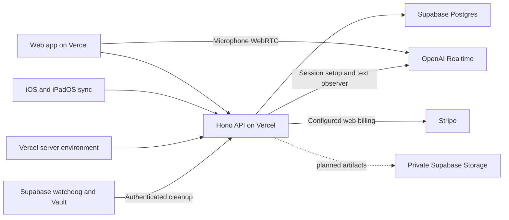

# Hosting and secrets for Sideleaf

Updated September 8, 2026. Sideleaf's authenticated notebook beta is hosted at [sideleaf.vercel.app](https://sideleaf.vercel.app). The Vercel Sideleaf project is linked to [ThinkHale/Sideleaf](https://github.com/ThinkHale/Sideleaf), and Supabase project `qhgzilyanroqomafhybg` hosts the private application database. Browser capture passed a hosted test with synthetic microphone input, real OpenAI transcription and Supabase persistence. Stripe billing is implemented, with sandbox credentials/testing still pending. Current evidence is recorded in [status.md](status.md).

## One shared backend

Vercel hosts the built React web app and the Node/Hono API. Supabase hosts PostgreSQL; Better Auth owns Sideleaf accounts and sessions. The web app uses same-origin `/api/*` routes. Browser microphone audio connects directly to OpenAI over WebRTC, while the server authorizes the session and observes final transcript events. The native app uses the same authenticated HTTPS API for sign-in and revision-based text/mark/transcript synchronization.

The browser OpenAI path has passed the hosted synthetic-microphone test described below. Stripe still needs a real sandbox test. The native app is distributed through Apple's tooling and only needs the public API URL and its user's session credentials. Native sign-in, versioned legal acceptance and revision-based synchronization are implemented in build `6`; hosted deployment verification of the accompanying API changes and physical-device runtime testing remain pending. PencilKit ink remains local.

## Components and execution

| Component                | Responsibility and status                                                           |
| ------------------------ | ----------------------------------------------------------------------------------- |
| GitHub                   | Source repository and Vercel project linkage                                        |
| Vercel static output     | Vite build under `dist/web`                                                         |
| Vercel Node function     | `api/index.ts` initializes Hono for `/api/*`                                        |
| Supabase Postgres        | 16 private tables for auth, notes, capture, usage, billing and legal acceptance     |
| Better Auth              | Password hashing, sessions and shared database-backed authentication limits         |
| Supabase pg_cron/pg_net  | 30-second capture cleanup calls using a Vault-held bearer secret                    |
| OpenAI                   | `gpt-4o-mini-transcribe` WebRTC, observer and saved text verified September 7, 2026 |
| Stripe                   | Implemented Checkout, portal, webhooks and entitlements; sandbox setup pending      |
| Supabase private Storage | Planned editable ink artifacts and permitted attachments                            |

The root [vercel.json](../vercel.json) is active and requests a 300-second function duration. Capture intentionally rolls its observer at about 225 seconds, with a disclosed reconnect gap. API responses are not cached by the service worker or CDN. The former [external-proxy template](../deploy/vercel.example.json) is historical and inactive. There is no separate Render service.

The API reuses one initialization promise and a bounded `pg.Pool` per warm instance, verifies auth-table access, and attaches Vercel's pool lifecycle support. Failed initialization can retry. Supavisor transaction pooling on port 6543 uses unnamed SQL queries. Verified TLS passed using the public Supabase root certificate bundled at `server/certs/supabase-root-2021.crt`. This certificate is public trust material.

The public origin is `https://sideleaf.vercel.app`. `APP_ORIGIN` can pin it, or the server can derive the relevant Vercel environment origin. Cookies, callbacks and mutation-origin checks must agree. Stripe's webhook uses a verified signature instead of browser Origin/session authentication. Watchdog maintenance uses its separate bearer secret.

Preview and production currently share the beta database. Either deployment can affect the same accounts and notes. Billing records include their Stripe test/live mode so sandbox purchases cannot grant live entitlements, but that is not full data isolation. Use separate preview data and credentials before wider production use.

## Credential locations

Shared credentials belong in the Sideleaf Vercel project's server environment. The API receives them at runtime; they are not copied into browser or native bundles. Environment changes require a new deployment. The watchdog additionally keeps a matching secret in Supabase Vault, referenced by the scheduled SQL rather than embedded as a literal value.

| Variable                                        | Secret?                   | Location and purpose                                                                 |
| ----------------------------------------------- | ------------------------- | ------------------------------------------------------------------------------------ |
| `DATABASE_URL`                                  | Yes                       | Vercel restricted `sideleaf_runtime` connection with verified TLS                    |
| `BETTER_AUTH_SECRET`                            | Yes                       | Stable Vercel authentication secret, at least 32 random characters                   |
| `MIGRATION_DATABASE_URL`                        | Yes                       | Administrative migration session only, outside request-serving configuration         |
| `OPENAI_API_KEY`                                | Yes                       | Vercel server credential for Realtime setup, observer and termination                |
| `CAPTURE_CRON_SECRET`                           | Yes                       | Vercel maintenance credential, matching Vault secret `sideleaf_capture_cron`         |
| `CAPTURE_ENABLED`                               | No                        | Explicit capture enable flag, default false                                          |
| `CAPTURE_WATCHDOG_ENABLED`                      | No                        | Explicit supervisor enable flag, default false; actual freshness is checked at Start |
| `STRIPE_SECRET_KEY`                             | Yes                       | Server Stripe credential for the configured test/live mode                           |
| `STRIPE_WEBHOOK_SECRET`                         | Yes                       | Signing secret for the exact Stripe endpoint/environment                             |
| `STRIPE_PRICE_PRO_MONTHLY`                      | No                        | Server-selected monthly Price ID                                                     |
| `STRIPE_MODE`                                   | No                        | `test` for sandbox, `live` for production billing                                    |
| `STRIPE_BILLING_ENABLED`                        | No                        | Explicitly enables purchases only after setup; default false                         |
| `ENABLE_PASSWORD_AUTH`                          | No                        | Explicit email/password beta opt-in                                                  |
| `APP_ORIGIN`                                    | No                        | Exact public HTTPS origin or environment-derived value                               |
| `NODE_ENV`                                      | No                        | `production` for the hosted function                                                 |
| `FREE_MONTHLY_MINUTES` / `FREE_MEETING_MINUTES` | No                        | Free connected-time limits, default 120/60                                           |
| `PRO_PRICE_USD`                                 | No                        | Displayed and validated monthly price, default 29                                    |
| `GOOGLE_CLIENT_ID` / `GOOGLE_CLIENT_SECRET`     | ID public, secret private | Optional Google login configuration; unverified                                      |
| `SUPABASE_SECRET_KEY` / `SUPABASE_URL`          | Key private, URL public   | Future private-Storage configuration, not needed by current clients                  |

Do not put shared credentials in `VITE_*`, native configuration files or Xcode build settings. Native Keychain storage is only for the user's bearer and cached account identity. Those device-only records form one session state and are cleared together on sign-out or invalidation. The cached identity selects the correct account-scoped offline pages but does not grant API access. Rotating a provider credential should require updating the backend and redeploying, without rebuilding clients. Hosted Stripe Checkout redirects do not require a browser publishable key.

The configured Windows launchers are `scripts/set-openai-key.cmd` and `scripts/set-stripe-key.cmd`. They prompt with hidden input and pass credentials through Vercel CLI stdin, creating no secret file. The Stripe launcher supports `preview`; the shared `scripts/set-provider-secret.mjs` accepts an explicit target and supports OpenAI, Stripe server and Stripe webhook secrets. Default target is production. Preview credentials must match preview billing mode. The launchers do not create products, publish legal terms, enable charges or prove a working provider integration.

Stripe CLI 1.50.10 is installed at `%LOCALAPPDATA%\Sideleaf\cli\stripe\stripe.exe`. `scripts/connect-stripe.cmd` opens its browser sign-in for the `sideleaf` profile and keeps CLI configuration at `%LOCALAPPDATA%\Sideleaf\secrets\stripe-cli.toml`, outside the OneDrive checkout. The owner needs to create a Stripe account before signing in; billing activation remains pending. CLI account authorization is separate from Vercel's server key and endpoint signing secret.

Supabase API keys and PostgreSQL passwords serve different interfaces. Current clients call Sideleaf's API and do not need Supabase Auth or a Supabase SDK. Future privileged Storage credentials remain server-only because they can bypass client RLS boundaries.

## Database, migrations and watchdog

Hosted tables live in the private `sideleaf` schema, excluded from the Data API. `PUBLIC`, `anon` and `authenticated` have no schema/table access. The runtime login has schema usage and table CRUD, no schema ownership/DDL, and no RLS bypass. Its role-level search path resolves Drizzle tables to `sideleaf`. RLS allows the backend role; Hono and Better Auth enforce per-account ownership.

All eight reviewed files under [supabase/migrations](../supabase/migrations) are applied and migration history is aligned. The original two migrations established notebook/auth storage and restricted the provider RLS helper. Three capture migrations add seven capture/billing tables, install watchdog extensions, and place pg_net under `extensions` with restricted net access. Three legal migrations add immutable versioned acceptance rows, bind each acceptance to a SHA-256 fingerprint of the displayed legal bundle, and restrict RLS policies to SELECT/INSERT for the backend role. The advisor reports only the existing leaked-password warning for unused Supabase Auth. This does not establish a complete security or legal audit.

The runtime connection has verified its role, schema and auth table and demonstrated denial of schema creation and anonymous schema use. Production startup runs no migrations. Local development uses PGlite with `server/migrations/001_notebook.sql`; local accounts and drafts are not automatically imported into the hosted database.

[supabase/capture-watchdog.sql](../supabase/capture-watchdog.sql) schedules cleanup every 30 seconds and removes its cron history after seven days. A Vault reference supplies the maintenance bearer secret. The application role has no cron/net schema privileges. Capture Start requires health within 90 seconds, and unsuccessful or backlogged cleanup does not refresh the healthy timestamp. Timing, metering and rollout checks are detailed in [live-capture.md](live-capture.md).

## Local development and Mac continuation

Keep real development secrets outside the OneDrive checkout or inject them into the process environment. Local scripts still load repository `.env` when present; an external-secret-file loader is not implemented. Git, Docker and `.vercelignore` exclude local databases, real environment files and generated service metadata. The blank `.env.example` remains trackable. Vercel upload exclusions are separate from Git ignores; the earlier clean deployment manifest was checked.

Continue on the Mac from the same GitHub repository. Node 24 runs the web/API tools. The checked-in native Xcode project opens directly in Xcode 26 or later; `native/project.yml` and XcodeGen maintain its structure, following [native/README.md](../native/README.md). Build `6` targets iPhone and iPad on iOS/iPadOS 26 or later. Complete signing, App Store upload and physical iPhone/iPad testing. Production database, OpenAI and Stripe credentials do not belong in the Xcode project.

## Verification and outstanding work

The current `npm run check` pass completed the production build and 135 passing Vitest tests across 13 files. Two focused legal-acceptance browser flows passed; the complete browser and built-PWA suites were updated but were not rerun in this pass. A real Supabase integration probe with a fake provider returned 200 for capture start/stop and cleaned its exclusively synthetic records. This confirms the production database adapter path. It does not verify actual OpenAI speech processing.

The hosted OpenAI tests passed using `gpt-4o-mini-transcribe` and Chromium synthetic microphone input on September 7, 2026. They verified WebRTC, the server observer/SSE stream, saved transcript text in actual Supabase, Pause with all microphone tracks ended and the server session finalized, one complete approximately 225-second rollover with new saved text, Resume and network-loss cleanup. Synthetic accounts were deleted. Physical microphone, native capture and repeated long-session reliability remain unvalidated. See [status.md](status.md) for the tested deployment and evidence locations.

Stripe needs credentials, environment-specific Price/webhook/portal configuration and a real sandbox purchase before production activation. See [billing.md](billing.md) for its activation contract.

The earlier hosted notebook passed authentication, persistence, ownership, origins, retry/conflict, exports and deletion, plus desktop/phone UI reload persistence. The earlier built-PWA offline/export and capture UI checks remain evidence but were not rerun in the current pass; hosted offline behavior has not been freshly retested. Build `6` still requires runtime testing. XCTest execution, native runtime, the new hosted deployment, email verification/password recovery, private artifact Storage and cloud coaching remain separate work.

The archive sets Boolean `ITSAppUsesNonExemptEncryption = false`, which matches the current native use of operating-system HTTPS and Keychain services and should prevent App Store Connect from asking the standard export-compliance question for every unchanged build. This declaration is the owner's compliance responsibility and must be reviewed again if a dependency or feature adds cryptographic functionality, VPN behavior or encryption beyond exempt operating-system services.

Sideleaf does not save audio recordings. Browser WebRTC audio and OpenAI's published provider retention are different parts of that disclosure. The implemented flow and remaining verification are documented in [privacy.md](privacy.md).
