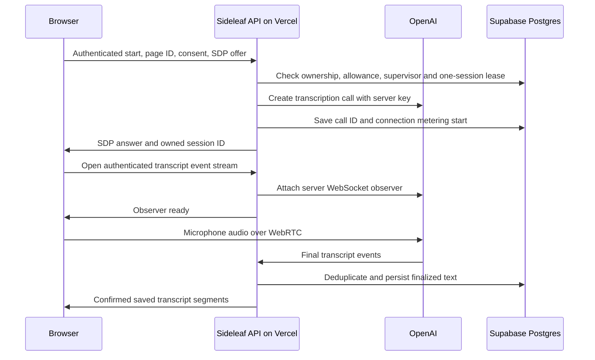

# Live capture implementation and setup

The browser has an OpenAI Realtime transcription path. On September 7, 2026, hosted Chromium tests with synthetic microphone input passed real OpenAI transcription, Supabase text persistence, Pause/Resume, one complete rollover and network-loss cleanup. Capture is enabled on the verified deployment and requires healthy session supervision. Native build `4` adds a separate on-device transcription path; physical microphone and native runtime validation remain separate work. See [verification status](status.md) for the exact scope and evidence.

## Native on-device transcription boundary

The native iPhone/iPad path uses Apple's iOS/iPadOS 26 speech analysis APIs and does not connect microphone audio to OpenAI, Vercel or Supabase. Before starting, the user must explicitly confirm participant consent and grant microphone and speech access. Audio buffers are bounded in memory, are not written to an audio file and are not queued or uploaded. Stopping, an interruption, a route loss or leaving the capture UI releases the audio engine.

Final on-device text can be saved with the page and synchronized through the ordinary revision protocol as personal user content. It must not be represented as a server-observed transcript segment, and it does not consume browser cloud-capture allowance. Device/language/model availability is surfaced without a remote fallback. Physical iPhone/iPad microphone, permission, interruption, background and finalization behavior has not yet been verified.

## Transport and trust boundary

`server/openai-capture.ts` creates a transcription-only call at `/v1/realtime/calls` using `gpt-4o-mini-transcribe` and server voice activity detection. `server/capture.ts` attaches to the call over a server-side WebSocket. The browser uses WebRTC for audio and a data channel for interim display. No shared OpenAI key is sent to the browser, and the native on-device path does not call these cloud-capture routes. [OpenAI Realtime transcription](https://developers.openai.com/api/docs/guides/realtime-transcription), [server-side controls](https://developers.openai.com/api/docs/guides/realtime-server-controls).

Only provider-final transcript events observed by the server become saved transcript records. Client text and client plan flags are not accepted as trusted provenance or paid entitlement. The server validates page/session ownership on each route. Ordinary page writes still reject forged transcript and AI blocks. Saved transcript text is separate from the manual page document.

## Sessions, usage and interruptions

The account row lock serializes start and deletion. The server permits one active assisted session per account, regardless of browser tab, and no more than five connection starts per minute. Free defaults are 120 connected minutes per UTC calendar month and 60 accumulated connected minutes per page/meeting. Paused and resumed sessions on the same page contribute to the same meeting total. Pro uses the server's verified entitlement and removes those product allowance limits; each provider connection still has a bounded deadline and is rolled over.

Metering starts when the provider SDP answer can enable audio, before it is exposed to the client. Connected time includes brief setup and silence. Failed provider creation before a usable call exists does not consume time. Paused time is excluded. Server settlement is transactional, deduplicated and divided at UTC month boundaries. The UI should show the reset instant in the user's locale. Deleting a page does not erase monthly usage.

A starting reservation allows 70 seconds for provider setup, while the provider request has a 45-second timeout. After a usable SDP answer arrives, the server starts metering and replaces that reservation with a 20-second lease for observer attachment. The active server observer renews the lease every 10 seconds, at most 25 seconds ahead and never past the enforced deadline. A browser heartbeat only reads server state; it cannot extend its own allowance. Supabase schedules the authenticated maintenance route every 30 seconds. New starts require watchdog health from within the last 90 seconds. Expired sessions are closed oldest first in bounded batches, and incomplete cleanup does not publish a new healthy timestamp. Provider termination failures remain eligible for retry.

`vercel.json` requests a 300-second function duration. The observer intentionally rolls the connection at about 225 seconds, leaving time for finalization and hangup. The browser automatically reconnects when it can safely do so. Audio during reconnection is not buffered for later upload; the UI must disclose this gap. One hosted real-provider rollover passed with new transcript text saved after reconnection. This is a beta rollover strategy, and repeated live rollovers need a real-device test before making long-meeting reliability claims.

Pause and Stop release browser microphone tracks immediately, tell the server to stop metering, commit the last speech turn, drain final text and close the provider call. A lost browser or killed server function relies on lease expiry and maintenance cleanup. This provides a retry path, not a guarantee that an unavailable third-party provider can be terminated instantly.

The observer caps WebSocket messages at 256 KiB, queued selected events at 64, per-segment text at 30,000 characters and predecessor tracking at 1,024 turns per connection. Processing errors stop the stream. Sideleaf does not use MediaRecorder, collect audio files, persist audio buffers, or queue audio offline. Browser-confirmed text that has not yet been confirmed by the server is labeled unconfirmed and can be copied/exported without pretending it is saved transcript.

## Routes and storage

| Route                                      | Purpose                                                     |
| ------------------------------------------ | ----------------------------------------------------------- |
| `POST /api/capture/sessions`               | Check consent/ownership/allowance and create a connection   |
| `GET /api/capture/sessions/:id/events`     | Attach the single server observer and stream confirmed text |
| `POST /api/capture/sessions/:id/heartbeat` | Read server lease state                                     |
| `POST /api/capture/sessions/:id/stop`      | Pause, stop or interrupt an owned connection                |
| `GET /api/capture/pages/:pageId`           | Read saved transcript segments and session metadata         |
| `GET /api/capture/usage`                   | Read allowance and reset timestamp                          |
| `GET /api/capture/maintenance`             | Secret-authenticated watchdog cleanup                       |

The old `/api/capture/start` placeholder is not the current client contract.

`capture_sessions` stores call/session ownership, state and timing. `meeting_transcripts` stores finalized text with provider item linkage; `(session_id, item_id)` is unique. `capture_usage` stores aggregate monthly milliseconds. `capture_watchdog` stores supervisor freshness. These tables remain in the private `sideleaf` schema with backend-only access and RLS. There are no audio columns or Storage buckets in this flow.

The live panel exports transcript text separately. Full account export includes saved transcripts. Normal page-document exports preserve their existing manual-note behavior. An active session must be stopped before its page or account can be deleted. Page deletion removes its transcript/session records; account deletion also removes its aggregate usage after capture and billing safeguards pass.

## Secrets and activation

| Server setting             | Purpose                                                             |
| -------------------------- | ------------------------------------------------------------------- |
| `OPENAI_API_KEY`           | OpenAI project/server credential in Vercel                          |
| `CAPTURE_CRON_SECRET`      | Random maintenance bearer secret shared with a Supabase Vault entry |
| `CAPTURE_ENABLED`          | Explicit capture enable flag, default false                         |
| `CAPTURE_WATCHDOG_ENABLED` | Explicit supervisor enable flag, default false                      |
| `FREE_MONTHLY_MINUTES`     | Free monthly connected-time allowance, default 120                  |
| `FREE_MEETING_MINUTES`     | Free per-page meeting allowance, default 60                         |

On the configured Windows checkout, `scripts/set-openai-key.cmd` securely prompts for the key and saves it to the Sideleaf Vercel production environment. Input is hidden, no secret file is created, and the value is sent through CLI stdin. A new deployment is required to use updated environment variables. The shared `scripts/set-provider-secret.mjs` also supports an explicit `preview` target. These are server values, never `VITE_*` values or native application settings.

Apply the reviewed Supabase migrations before deploying code that needs the capture tables. `supabase/capture-watchdog.sql` defines the 30-second supervisor and its seven-day cron-history cleanup. The supervisor job reads the bearer value from a Vault secret named `sideleaf_capture_cron`; its SQL contains a Vault reference rather than a literal credential. The same value must be configured as `CAPTURE_CRON_SECRET` in Vercel. Only the administrator needs permission to install or change these jobs; the application runtime role does not have cron/net schema privileges.

The deployed provider credential/model access, capture migrations and healthy watchdog were exercised by the successful hosted tests. WebRTC, the server observer, confirmed saved transcript, Pause/Resume, one complete approximately 225-second rollover with new saved text and network-loss cleanup passed against real OpenAI and Supabase services. The exclusively synthetic QA accounts were deleted. These browser tests used a synthetic microphone fixture; they do not establish physical microphone, iOS behavior or repeated long-meeting reliability.

For a new environment, configure the provider credential, apply the migrations, install the authenticated watchdog and verify fresh health before enabling capture. Review that account's provider retention mode against the [audio privacy document](privacy.md). OpenAI Realtime's default abuse-monitoring retention is distinct from Sideleaf's no-saved-audio behavior. [OpenAI data controls](https://developers.openai.com/api/docs/guides/your-data).

The server fails closed when configuration, allowance, ownership or supervision checks do not pass. Manual notes and already saved text remain available. Native on-device transcription remains independent of this cloud service and cannot capture system or remote-call audio. This implementation does not add native cloud capture, speaker attribution, coaching or automatic summaries.
